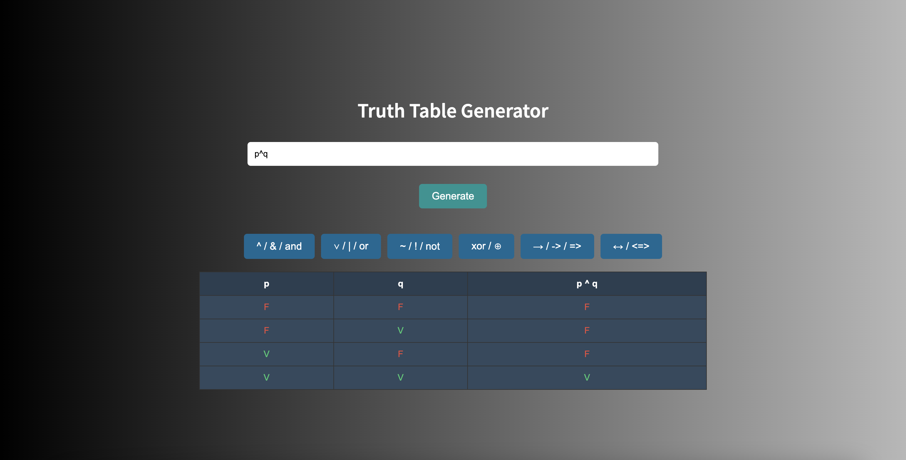

# Proyecto de Logica y Estructuras Discretas
<table>
<tr>
<td>
Generador de Tablas de Verdad

Este proyecto es una aplicación web que genera tablas de verdad a partir de expresiones lógicas. 
Utiliza **FastAPI** como backend y **Flask** como frontend.
</td>
</tr>
</table>


## 🚀 Como probar nuestro generador
A continuacion se dejan las instrucciones para ejecutar nuestro proyecto:

Asegúrate de tener instalados los siguientes programas:

1. **Python 3.8 o superior**  
   - Verifica si está instalado ejecutando:
     ```sh
     python --version
     ```
   - Si no lo tienes, descárgalo de [python.org](https://www.python.org/downloads/)

2. **Git** (para clonar el repositorio)  
   - Verifica si está instalado con:
     ```sh
     git --version
     ```
   - Si no lo tienes, descárgalo desde [git-scm.com](https://git-scm.com/downloads)

---

## 📂 Instalación
### 1️⃣ Clonar el Repositorio
Abre una terminal o consola y ejecuta:
```sh
git clone https://github.com/LuisAAO2694/proyectoLogica.git
```

### 2️⃣ Crear y Activar el Entorno Virtual
Ya que tenemos nuestro repo clonado necesitamos entrar a la carpeta correspondiente que es 

```sh
cd proyectoLogica
```
Ya en la carpeta corremos los siguientes comandos en la terminal

**En Windows:**
```sh
python -m venv venv
venv\Scripts\activate
```

Verifica que el entorno esté activo, debería aparecer `(venv)` al inicio de la línea de comandos.

### 3️⃣ Instalar Dependencias
Ejecuta el siguiente comando para instalar todas las dependencias necesarias esto en la carpeta raíz (proyectoLogica):

**En Windows:**
```sh
pip install flask fastapi uvicorn requests
```

**En Mac\Linux:**
```sh
pip3 install flask fastapi uvicorn requests
```

---

## ▶️ Ejecución del Proyecto

### **1️⃣ Iniciar el Backend (FastAPI)**
Ejecuta los siguientes comandos:

**En Windows:**
```sh
cd backend
python app_fastapi.py
```

**En Mac\Linux:**
```sh
cd backend
python3 app_fastapi.py
```

Si todo está correcto, verás un mensaje indicando que el servidor FastAPI está corriendo en:
```
INFO:     Uvicorn running on http://127.0.0.1:8000
```
Puedes probarlo visitando en tu navegador:  
👉 [http://127.0.0.1:8000](http://127.0.0.1:8000)

### **2️⃣ Iniciar el Frontend (Flask)**
Abre una **nueva terminal**, activa el entorno virtual si es necesario y ejecuta:

**En Windows:**
```sh
cd frontend
python app_flask.py
```

**En Mac\Linux:**
```sh
cd frontend
python3 app_flask.py
```
Si todo está correcto, verás un mensaje indicando que el servidor Flask está corriendo en:
```
 * Running on http://127.0.0.1:5000/
```
Puedes abrirlo en tu navegador:  
👉 [http://127.0.0.1:5000](http://127.0.0.1:5000)

---

## Página de destino



### **Desarrollo**  
¿Quieres contribuir? ¡Genial!  

Para corregir un error o mejorar un módulo existente, sigue estos pasos:  

- Haz un **fork** del repositorio.  
- Crea una nueva rama (`git checkout -b mejorar-funcionalidad`).  
- Realiza los cambios correspondientes en los archivos.  
- Asegúrate de reflejar correctamente los cambios realizados.  
- Confirma tus cambios (`git commit -m 'Mejorar funcionalidad'`).  
- Sube los cambios a la rama (`git push origin mejorar-funcionalidad`).  
- Crea un **Pull Request**.  

### **🛠 Solución de Problemas**  
Si encuentras un error (por ejemplo, el sitio web no puede procesar la consulta o devuelve resultados inesperados), abre un **issue** [[aquí](https://github.com/LuisAAO2694/proyectoLogica/issues)] e incluye la consulta que realizaste y el resultado esperado.  


## 🎯 Tecnologías Utilizadas

- [Python 3](https://www.python.org/) - Lenguaje base del proyecto, utilizado para la lógica principal.  
- [Flask](https://flask.palletsprojects.com/en/stable/) - Framework usado para la parte del frontend y el diseño de la aplicación.  
- [FastAPI](https://fastapi.tiangolo.com/) - Usado como servidor backend, encargado de manejar la lógica del proyecto.   
- **Uvicorn** (Servidor ASGI)
- **HTML + CSS**


## Team

| [](https://github.com/SantiagoRL48)  | [](https://github.com/Jgalvan33) | [](https://github.com/LuisAAO2694) |
|---|---|---|
| [Santiago](https://github.com/SantiagoRL48) | [Jaime](https://github.com/Jgalvan33) | [Luis](https://github.com/LuisAAO2694) |


👨‍💻 **Desarrollado por:** Lombardi Team - ITESO © 

## 📜 Licencia
Este proyecto es de código abierto bajo la licencia MIT.
